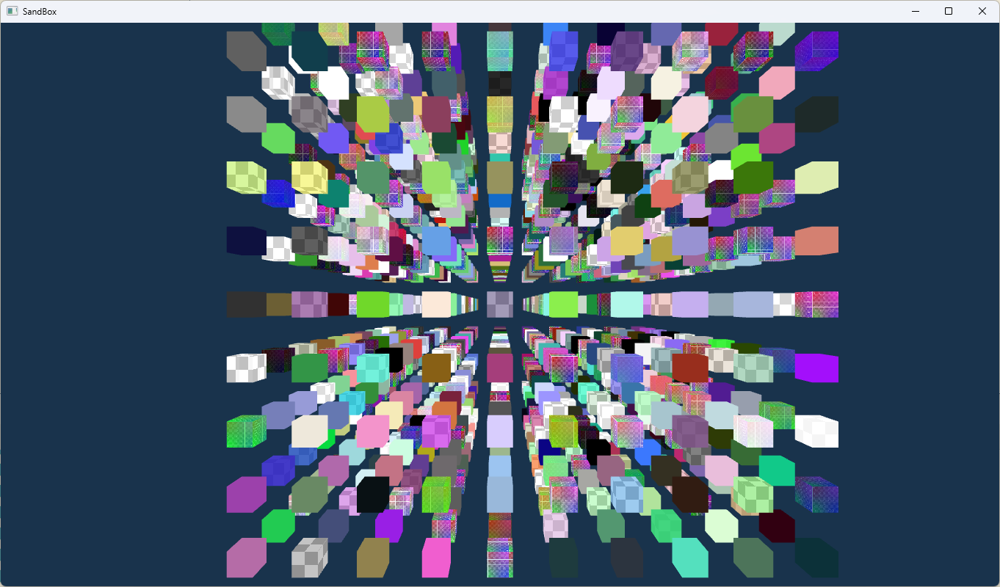

# Chimi Engine



`Chimi Engine` is a small graphics engine project built with `C++20`, `CMake`, and `Vulkan`. The repository already includes a platform layer, rendering infrastructure, ECS, material systems, and a couple of runnable samples, making it a solid foundation for rendering experiments and engine learning.

## Current Status

- Vulkan-based graphics backend
- `GLFW` for windowing and input
- `GLM` for math
- `spdlog` for logging
- `VulkanMemoryAllocator` for GPU memory allocation
- `tinygltf` integrated for asset loading
- `EnTT` for ECS

The repository currently includes two executable samples:

- `00_FirstTriangle`: a minimal Vulkan triangle example
- `SandBox`: an experimental scene built on top of `CmApplication`, `RenderTarget`, material systems, and ECS

## Project Structure

```text
.
|-- Core/        Core engine layer: Application, Render, ECS
|-- Platform/    Platform abstraction and low-level graphics wrappers
|-- Editor/      Editor module, currently a placeholder interface
|-- Resource/    Runtime assets such as shaders, models, textures, and env maps
|-- Sample/      Sample applications
|-- cmake/       Dependency and CMake helper scripts
|-- chimi.png    Project image
```

## Main Modules

### Platform

`Platform` provides the window system, logging, events, and Vulkan wrappers. The current layout includes:

- `Window/`: window abstraction and the `GLFW` implementation
- `Event/`: input and window event dispatching
- `Graphic/`: Vulkan device, swapchain, command buffer, render pass, pipeline, and related abstractions

### Core

`Core` builds higher-level engine functionality on top of `Platform`:

- `CmApplication`: application lifecycle entry point
- `Render/`: render context, render target, mesh, texture, material, and renderer
- `ECS/`: entities, scenes, components, and systems

### Sample

`Sample` is the easiest place to start exploring the project:

- `00_FirstTriangle`: verifies the window, swapchain, render pass, pipeline, and shader compilation flow
- `SandBox`: demonstrates camera control, material systems, textures, batch cube generation, and basic interaction

## Requirements

Recommended setup on Windows:

- `CMake >= 3.25`
- A compiler with `C++20` support
  - `Visual Studio 2022` is recommended
- `Vulkan SDK`
  - required for Vulkan headers, libraries, and `glslc`
- A network-enabled environment
  - dependencies are fetched automatically during the first configure step

The project currently fetches these third-party dependencies through `FetchContent`:

- `glfw`
- `glm`
- `spdlog`
- `volk`
- `VulkanMemoryAllocator`
- `tinygltf`
- `entt`
- `stb`

## Build

### Using CMake Presets

The repository already includes `CMakePresets.json`:

```powershell
cmake --preset debug-msvc
cmake --build --preset build-debug
```

Available presets in the repository:

- Configure presets: `debug-msvc`, `release-msvc`
- Build presets: `build-debug`, `build-release`

To inspect available presets locally:

```powershell
cmake --list-presets
```

### Generic CMake Flow

```powershell
cmake -S . -B build
cmake --build build --config Debug
```

## Run

After building, executables are typically placed under the build directory's `bin` folder.

Runnable targets include:

- `00_FirstTriangle`
- `SandBox`

If you are using a multi-config generator such as Visual Studio, a typical run command looks like:

```powershell
.\build\bin\Debug\00_FirstTriangle.exe
.\build\bin\Debug\SandBox.exe
```

The exact output path may vary depending on the generator and preset you use.

## Shader and Resource Notes

- `00_FirstTriangle` compiles its sample shaders into the build directory under `generated/shaders`
- `SandBox` compiles shaders directly into `Resource/Shader/*.spv`
- The runtime resource root defaults to the repository's `Resource/` directory

The repository currently includes:

- `Resource/Shader/`: vertex and fragment shaders
- `Resource/Texture/`: test textures
- `Resource/Model/`: sample models
- `Resource/EnvMap/`: environment maps

## Possible Next Steps

- Implement real functionality in the `Editor` module
- Expand the resource system and model import pipeline
- Add more materials and render passes
- Introduce scene serialization and editor panels
- Add tests, screenshots, and more development documentation

## References

- [adiosy_engine](https://gitee.com/xingchen0085/adiosy_engine#adiosy_engine)